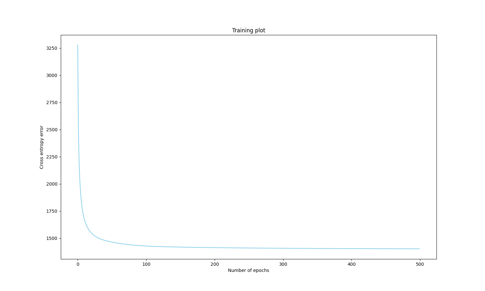
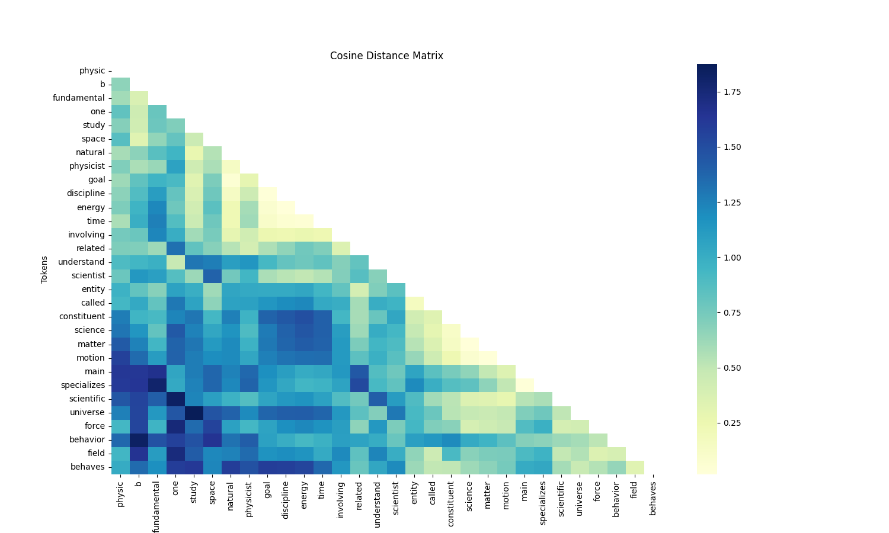

# Word2Vec implementation
Word2Vec embedding method implemented with numpy on a small token sized text about physics, from Wikipedia:
*Physics is the natural science of matter, involving the study of matter, its fundamental constituents, its motion and behavior through space and time, and the related entities of energy and force. Physics is one of the most fundamental scientific disciplines, with its main goal being to understand how the universe behaves. A scientist who specializes in the field of physics is called a physicist*

